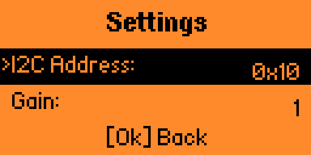

# 💡 VEML7700 Lux Meter for Flipper Zero

This is an application for the **Flipper Zero** device that measures ambient light intensity using a **VEML7700 sensor** and displays the result in lux ($\text{lx}$).

---
## 📸 Screenshots

| Main Screen | Gain Settings | I2C Address Settings |
| :---: | :---: | :---: |
|  |  |  |

---
## ✨ Features

* **Real-time Reading:** The application continuously refreshes and displays the measured light intensity value.
* **Configurable Gain:** The user can easily adjust the sensor's gain, which allows for measurements in various lighting conditions, from very dim to very bright. Available options are: **1/8, 1/4, 1**, and **2**.
* **I2C Address Change:** The I2C address of the VEML7700 sensor can be configured.
* **Simple Menu:** Intuitive navigation using the Flipper Zero buttons (**OK**, arrows, **Back**).

---
## 🛠️ Hardware Requirements

* **Flipper Zero** device.
* **VEML7700** ambient light sensor connected to the GPIO pins (I2C).

---
## 🚀 Usage

1.  Make sure the VEML7700 sensor is correctly connected to the Flipper Zero (I2C pins).
2.  Launch the application. By default, it will show the light intensity value.
3.  To go to the settings, press the **OK** button. In the settings menu, you can change the **Gain** and the **I2C address**.
4.  Use the **left and right** buttons ($\leftarrow$/$\rightarrow$) to change the values in the settings.
5.  After changing the settings, the application will automatically re-initialize the sensor with the new configuration.
6.  To return to the main screen, press **OK** or **Back**.
7.  Press the **Back** button on the main screen to exit the application.

---
## 💻 Code Structure

* `veml7700_app.c`: The main application file.
* `veml7700_app()`: The main program function containing the data reading and screen update loop.
* `init_veml7700()`: Function that configures the VEML7700 sensor, including setting the user-selected gain.
* `read_veml7700()`: Function that reads raw data from the sensor and calculates the lux value, considering the selected gain.
* `veml7700_draw_callback()`: Handles the drawing of each screen (main, settings, info).
* `veml7700_input_callback()`: Processes input events (key presses) for menu navigation and settings changes.
